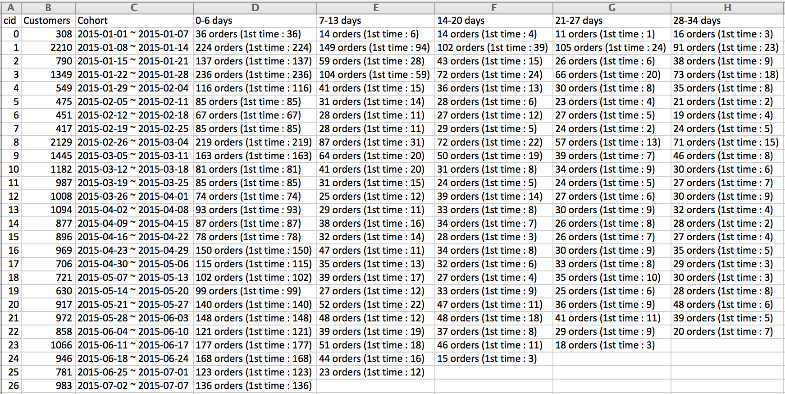

# Cohort Analysis

## Installation

After clone this repository, to install all the required package you simply put: 
```
$ pip install -r requirements.txt 
```
This app will run on Python 2.7.6

## Usage

After you cloned the repository, you can run the App using :

```
$ python app.py
```
SINGUP_DATA = 'input/customers_(4).csv'
ORDER_DATA = 'input/orders_(4).csv'

OUT_CSV = 'output/result.csv'
OUT_HTML = 'output/result.html'

To change the input data, put the input file name as SINGUP_DATA, ORDER_DATA variable in app.py. The input file should have the same format as customer_(4).csv and orders_(4).csv. 

The output files are CSV and HTML file. The output file will be saved as result.csv and result.html in output folder.




```
     Customers                   Cohort                     0-6 days                        7-13 days       \    ....
cid
0          308  2015-01-01 ~ 2015-01-07    36 orders (1st time : 36)	     14 orders (1st time : 6)  
1         2210  2015-01-08 ~ 2015-01-14  224 orders (1st time : 224)	   149 orders (1st time : 94)
2          790  2015-01-15 ~ 2015-01-21  137 orders (1st time : 137)        59 orders (1st time : 28)
3         1349  2015-01-22 ~ 2015-01-28  236 orders (1st time : 236)       104 orders (1st time : 59)
4          549  2015-01-29 ~ 2015-02-04  116 orders (1st time : 116) 		41 orders (1st time : 15)

...

```